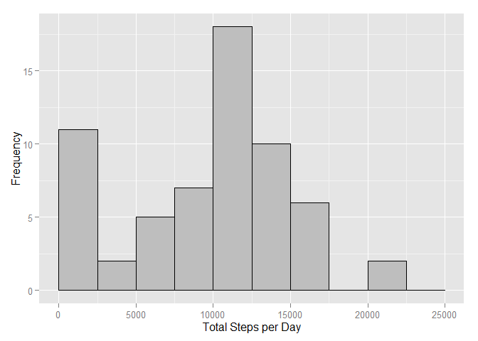
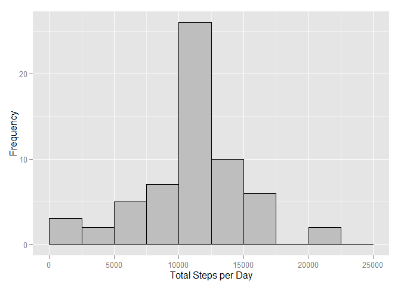
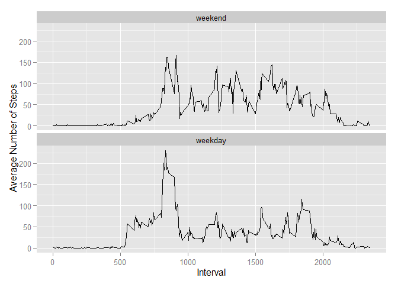

# Reproducible Research: Peer Assessment 1


## Loading and preprocessing the data

Unzip and load the data from the provided archive:


```r
unzip("activity.zip", overwrite = TRUE)
activity0 <- read.csv("activity.csv")
```

Preprocess the data frame, converting the date column from factor to a proper Date:


```r
library(dplyr)
library(lubridate)
activity1 <- tbl_df(activity0 %>% mutate(date = parse_date_time(date, "%Y-%m-%d")))
```

## What is mean total number of steps taken per day?

Histogram for total amount of steps per day:


```r
library(ggplot2)
steps.by.day1 <- activity1 %>% group_by(date) %>% summarise(total_steps = sum(steps, na.rm = TRUE))
ggplot(data = steps.by.day1, aes(total_steps)) + 
    geom_histogram(breaks = seq(0, 25000, by = 2500), col = "black", fill = "gray") + 
    labs(x = "Total Steps per Day", y = "Frequency")
```

 

Mean and media of all the total steps per day:


```r
activity1.stats <- summarise(steps.by.day1, mean = mean(total_steps, na.rm = TRUE), median = median(total_steps, na.rm = TRUE))
activity1.stats$mean
```

```
## [1] 9354.23
```

```r
activity1.stats$median
```

```
## [1] 10395
```

## What is the average daily activity pattern?

The average steps taken for each 5 minute interval is:


```r
steps.by.interval <- activity1 %>% group_by(interval) %>% summarise(average_steps = mean(steps, na.rm = TRUE))
ggplot(data = steps.by.interval, aes(interval, average_steps)) + 
    geom_line() +
    labs(x = "Interval", y = "Average Number of Steps")
```

 

The interval with the highest average is:


```r
top_n(steps.by.interval, 1, average_steps)$interval
```

```
## [1] 835
```

## Imputing missing values

Total number of rows with NA observations:


```r
na.rows <- activity1 %>% filter(is.na(steps)) %>% count()
na.rows$n
```

```
## [1] 2304
```

Replace missing steps with mean of the same interval accross all days:


```r
DefaultAverage <- function(x, y) {
    if (is.na(x)) {
        round((filter(steps.by.interval, interval == y))$average_steps, 0)
    } else {
        x
    }
}
activity2 <- activity1 %>% mutate(steps = mapply(DefaultAverage, steps, interval))
```

Histogram for total amount of steps per day:


```r
steps.by.day2 <- activity2 %>% group_by(date) %>% summarise(total_steps = sum(steps, na.rm = TRUE))
ggplot(data = steps.by.day2, aes(total_steps)) + 
    geom_histogram(breaks = seq(0, 25000, by = 2500), col = "black", fill = "gray") + 
    labs(x = "Total Steps per Day", y = "Frequency")
```

 

We can see that the frequency for totals between 0 and 2500 is reducing significantly, while the total range with the highest frequency is now even higher. Both, the mean as well as the median increase as expected:


```r
activity2.stats <- summarise(steps.by.day2, mean = mean(total_steps, na.rm = TRUE), median = median(total_steps, na.rm = TRUE))
activity2.stats$mean
```

```
## [1] 10765.64
```

```r
activity2.stats$median
```

```
## [1] 10762
```

## Are there differences in activity patterns between weekdays and weekends?

Adding an additional factor variable for indicating weekday vs. weekend observations:


```r
library(chron)
activity3 <-
    activity2 %>% mutate(day.factor = factor(
        is.weekend(date), levels = c(TRUE, FALSE), labels = c("weekend", "weekday")
    ))
```

The average steps taken for each 5 minute interval separated by weekend and weekdays are:


```r
steps.by.interval2 <- activity3 %>% group_by(interval, day.factor) %>% summarise(average_steps = mean(steps, na.rm = TRUE))
ggplot(data = steps.by.interval2, aes(interval, average_steps)) + 
    geom_line() +
    facet_wrap(~day.factor, ncol = 1) +
    labs(x = "Interval", y = "Average Number of Steps")
```

 
